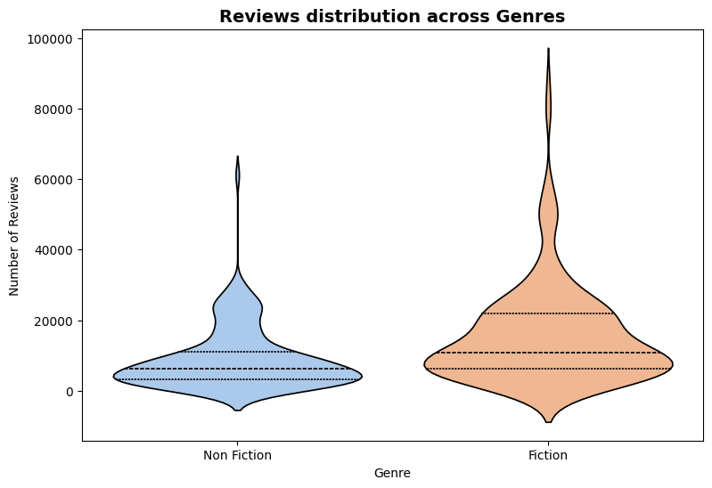
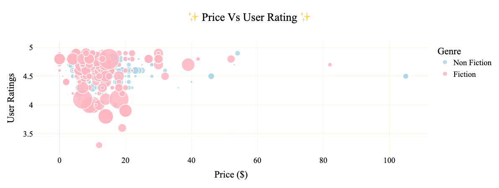

# 📚 Amazon Bestselling Books Analysis
(

A data-driven exploration of Amazon’s bestselling books to uncover patterns in  
📊 pricing, ⭐ ratings, 🗂️ genres, and 📈 customer engagement.

Built using Python and exploratory data analysis techniques.
> Turning raw book data into readable insights.

## 📊 Visual Insights

### Reviews Distribution by Genre

### Price vs User Rating

## 🔍 Key Findings

- 📘 Non-fiction books appear more frequently among Amazon bestsellers  
- 📕 Fiction books receive higher average review counts  
- 💰 Book price shows weak correlation with user ratings  
- ⭐ High ratings are consistent across most price ranges

## 🛠️ Tools & Technologies

- Python  
- Pandas  
- NumPy  
- Matplotlib  
- Seaborn  
- Jupyter Notebook

## 📂 Project Structure

- notebooks/ — exploratory data analysis  
- assets/ — saved visualisations  
- datasets/ — source data  
- README.md — project overview

## ✅ Project Status
Completed — Exploratory Data Analysis

